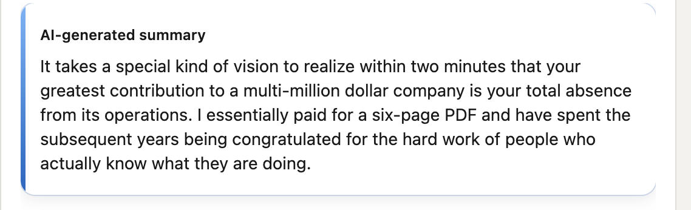
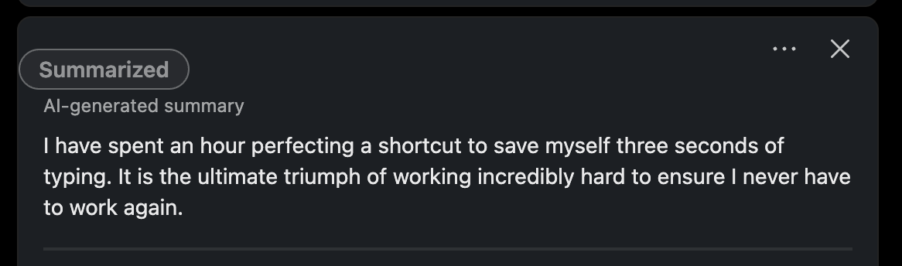

# Meme Summary for LinkedIn

Live Demos

1. 
2. 

A Chrome extension that turns the LinkedIn feed into a meme by summarizing each post into its honest subtext — with one quiet button.

## Vision

Turn the LinkedIn feed into a meme by summarizing each post into its honest subtext. "If this post were honest and short, what is it really saying?"

## Features

- Summarize LinkedIn posts into their honest subtext with one click

## Quick Start

1. **Get an API Key:** Get a free Gemini API key from [Google AI Studio](https://aistudio.google.com/).
2. **Install:** Go to `chrome://extensions/`, enable **Developer mode**, click **Load unpacked**, and select this folder.
3. **Configure:** The options page will open automatically. Paste your API key and click **Save**.

## How to Use

1. Navigate to your [LinkedIn Feed](https://www.linkedin.com/feed/).
2. You will see a "Summarize" button next to the three-dot menu on valid posts.
3. Click the button to replace the post's text with its honest subtext. Let the hilarity ensue.
